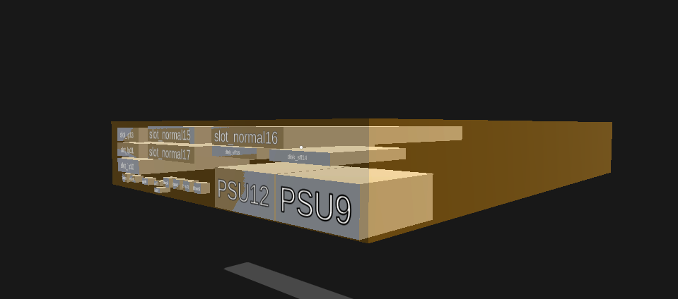
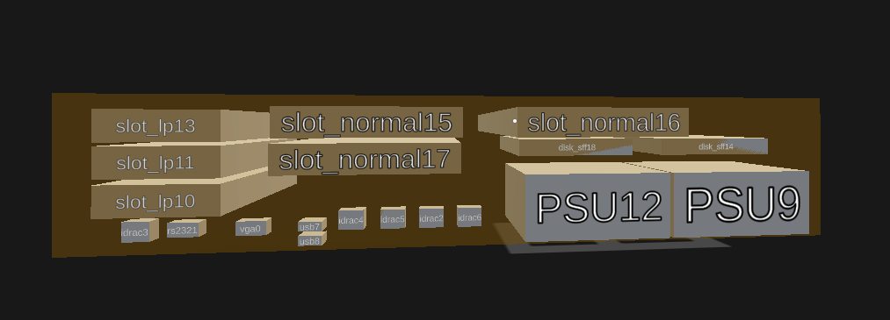

# COMPOS user guide

This is a user guide for COMPOS api, a powerful program who can locate the components on the board of server, output the coordinate in mm. After all, we can generate the model on the 2d face, then we put this face on the 3d model's front and back face.
## Components supported
| Name | method |
| ------ | ------ |
| idrac | template matching |
| usb | rectangle detect |
| d-sub female/vga | image's feature points |
| d-sub male/rs232 | image's feature points |
| slot normal | YOLOV5 object detection |
| slot lp | YOLOV5 object detection |
| disk lff | YOLOV5 object detection |
| disk sff | YOLOV5 object detection |
| power supply unit | YOLOV5 object detection |
## Requirement
YOLOV5 needs to be cloned from [YOLOV5 official page](https://github.com/ultralytics/yolov5#tutorials) in the `3dtools` directory.
Package infomation in [requirements.txt](requirements.txt)

## Setup

```sh
git clone https://github.com/ditrit/OGrEE-Tools.git
cd OGrEE-Tools/3dtools
pip install -r ./requirements.txt
#yolov5 installation
git clone https://github.com/ultralytics/yolov5
cd yolov5
pip install -r ./requirements.txt
```

_setup script coming soon_

## Introduction
### main.py
This is the general pilot of all the functions, and also the user interface.  
Here is a minimum tutorial example. 
```sh
cd Compos path
python main.py --servername image/serveur/dell-poweredge-r720xd.rear.png --height 86.8 --length 482.4
```
Some basic parameters should be told before start the program. 
> --servername : string, the file name of image.   
 --height : float, horizontal dimension, (unit mm).  
 --length : float, vertical dimension, (unit mm).  
 --face : string, 'front' or 'rear'  
>
User can also just run the *main.py* in python consoler. In this case, a default server "dell-poweredge-r720xd.rear.png" will be shown.

There are other parameters that the user can choose, to control algorithm's performance.  
> #yolov5 hyparameter
    --weights, type:str, model path or triton URL, if not want to change the yolov model, don't use it!  
    --conf-thres, type:float, default=0.5, confidence threshold, yolov will filter the result less than it.  
    --iou-thres, type=float, default=0.45, 'NMS IoU threshold'  
    --device', default='cuda device, i.e. 0 or 0,1,2,3 or cpu'  
    --view-img', if provided, show results on screen.   
    --save-txt', if provided, save results to *.txt'.  
    --save-conf', if provided, save confidences in --save-txt labels'  
    --save-crop', if provided, save cropped prediction boxes.  
    --nosave', if provided, do not save images/videos'  
    --augment', if provided, augmented inference'.  
    --visualize', if provided, visualize features.  
    --project', default=ROOT / 'detect', help='save results to project/name'  
    --name', default='exp', Save results to "project/name"  
    --exist-ok', If provided, existing project/name ok, do not increment, like exp1, exp2...  
    --line-thickness', default=1, type=int, Bounding box thickness (pixels)  
    --hide-labels', default=False, If provided, hide labels  
    --hide-conf', default=False, action='store_true', help='if provided, hide confidences  
>
After setting all the parameters for classifier(this step can also be replaced by executing data base automatically in the future), the program will creat a classifier class named ogree, then go on each defined classifier. Use ogree.clxxxx to detect component xxxx. It doesn't need any input at this step.

### Step
#### 1. Use the following code to start the program.
```sh
cd COMPOS path
python main.py --servername image/serveur/dell-poweredge-r720xd.rear.png --height 86.8 --width 482.4 --face rear
```
#### 2. Input the command 
It will be seen: 
```sh
class list: {'d-sub female': '11', 'd-sub male': '12', 'idrac': '13', 'usb': '14', 'all': '15'} 
or enter the name 'slot', 'disk', 'source'(without '') 
Please input one by one. Enter 'finish' to output the json
----Enter component name or code:
```
The user is asked to enter the component name or code. Here is an example:
```sh
d-sub female
```
or
```sh
11
```
The result is printed in the window shows "xxx in [x,y,angle,similarity]"
```sh
start detecting d-sub female
0° searching progress:  100%:  ▋▋▋▋▋▋▋▋▋▋▋▋▋▋▋▋▋▋▋▋▋▋▋▋▋▋▋▋▋▋▋▋▋▋▋▋▋▋▋▋▋▋▋▋▋▋▋▋▋▋

90° searching progress:  100%:  ▋▋▋▋▋▋▋▋▋▋▋▋▋▋▋▋▋▋▋▋▋▋▋▋▋▋▋▋▋▋▋▋▋▋▋▋▋▋▋▋▋▋▋▋▋▋▋▋▋▋

vga in : [[640.0, 860.0, 0.0, 0.7698690075499673]]
```
**Attention:** the type of input code is *string*. If we want transform it into a interface connect with other program, the command should also be *string*, not int.
#### 3. Finish and output
After detect all the components, type in finish to start the output processing.
```sh
finish
```
The program will generate the json file and saves it under floder api with the server name + '.json', It will show:
```sh
{(16, 92): ('vga', 0.0, 0.8375591957768449), (16, 59): ('rs232', 0, 0.8667459425301842), ...}
dell-poweredge-r720xd  json file in "/api/"
```
The json file is written in the form like:
```sh
[{"location": "vga0", "type": "", "elemOrient": "horizontal", "elemPos": [92.0, 0, 9.0], "elemSize": [16.0, 11.0, 8.0], "labelPos": "rear", "color": "", "attributes": {"factor": "", "similarity": 0.7698690075499673}},{...},...]
```
## Result of test example
### json file
The json file of test example dell-poweredge-r720xd.rear should be same as [test.json](api/test.json) if lanch the command from 11 to 15.
### 3d model
origin photo

3d model


# Description of standard server (components): 
## standard image/components
We choose a model ibm-x3690x5.rear like the standard server. this image gives a ratio of 9.14x pixel /mm. and standard components idrac, rs232, vga are captured and are saved at the path /image/standard/. Another idrac template is captured from *cisco-c240-m6-lff.rear.png*, just used for cisco models.

The standard components usb is captured from *ibm-x3690x5.rear.png* and are saved at the path /image/standard/.  
explaination:
In std_vga and std_rs232, the ibm has draw larger holes than other manufacturer in the picture.  
Interface idrac in cisco has a different shape than other manufacturer. The pins is more short.


## Classifiers in *Classifier* class:
### clidrac:
Based on template matching, the program will use the standard image of idrac to compare each slice of image, and calculate the similarity. Then a local_peak function is applied to find out the posible position where pass the threshould. (The threshould is setted as 0.45)

### clvgars232:
This classifier is designed to find vga or rs232 at the same time. Because they have the same shape. 
The methods applied is CENSURE algorithem. It process out the image features, which is pin positions here. 

### clusb: 
This classifier is designed to find power block in the image. We use the same template matching method to find out c14 interface. This gives a point situating in the block. Power block usually has a rectangle edge with a unit dimention. So we use a straight line detection function to find suspect rectangles of the same dimension. Last, an algorithem based on vector geometric calculation will decide whether the point is in this rectangle, i.e. is yhis the power bloc we are.searching.

## Foreign methode YOLOV5
The api file of yolov5 is under */api/yoloapi.py*. It is similar with the one under */yolov5/detect.py*. But with difference in coordinates treatment and more simple. Some unnecessary parameters and codes have been moved. The user can detct all the slots, disks, PSU with command *all*. And it is also capable to detect one or two among them. 
| Command |task type(s) |
| ------ | ------ |
| all | slot normal, slot lp, disk sff, disk lff, psu |
| disk |  disk lff, disk sff |
| slot | slot normal, slot lp |
| disk_sff | disk sff |
| disk_lff | disk lff |
| slot_normal | slot normal |
| slot_lp | slot lp |
| source | power supply unit |


The dect result of yolov5 will also saves under /detect/exp x/, user can check the output there. But remember to clean the flod regularly for not occupying too many space.
#### Mark:
- The unit dimention of power supply unit differs among each producer. An data base is needed to be created to give this information.  
- An excel about the shape of the server is created under */image/name_list.xlsx*. But not every data is ensured to be correct. 
- A very comment erro is the axis x,y are inversed, This is because the indexs in different library is not same. Some is (vertical down, horison right), some is (horison right, vertical down). For the further programming, check the axis order when classifier give wrong position with hight similarity, when component position is out of the picture. For the user, they can trust the present version and all these bug is gone. 
- In COMPOS code, the origin point situates on upper left corner of the picture. In json file, the 3d origin point situates on down right back corner of the brick.
