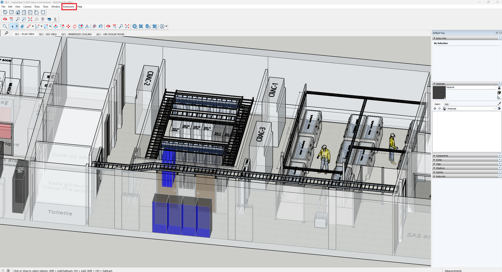
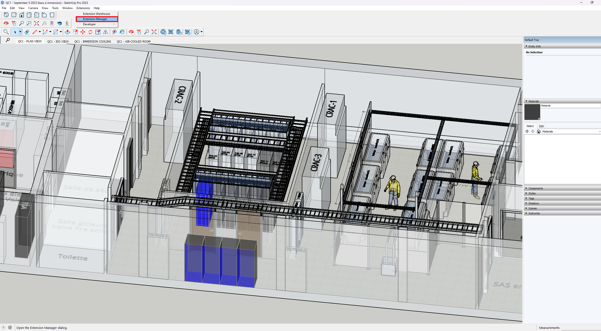
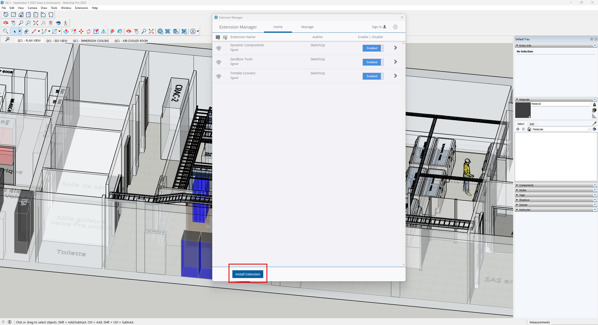
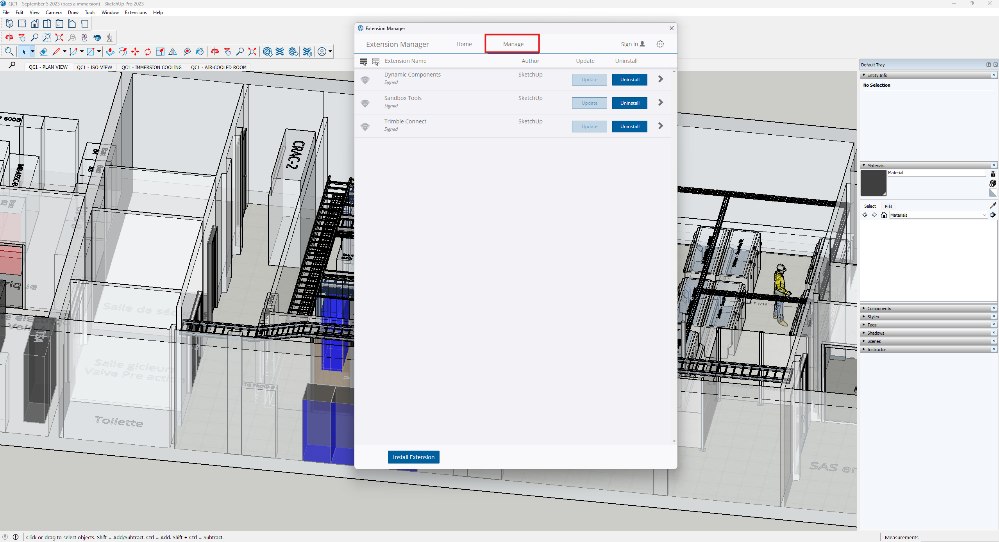

# OGREE TOOL: Sketchup to OGREE Converter Plugin

This is a guide for the plugin OGREE Converter for Sketchup PRO 2023

- [OGREE TOOL: Sketchup to OGREE Converter Plugin](#ogree-tool-sketchup-to-ogree-converter-plugin)
  - [Compile](#compile)
  - [Installation](#installation)
  - [Remove](#remove)


## Compile
The plugin is written in Ruby, but in order for plugins to be registrable in Sketchup PRO 2023, you **must** compile the code to a **.rbz** compressed file.

To do that, you must :
1. Create a **.zip** compressed file that contains all the **.rb** files of the plugin
2. Change the compressed file extension to **.rbz**

*Optional*: You can use the batch script below to automate the compilation of the plugin
```bash 
@echo off

rem Define the directory to zip, a directory that contains the implementation of the plugin
set "dir_to_zip=skp2ocli"

rem Define the file to include, a file that contains the declaration and metadata of the plugins
set "file_to_include=skp2ocli.rb"

rem Build the zip file
set "zip_name=skp2ocli.zip"
if exist "skp2ocli.rbz" (
  del /q "skp2ocli.rbz"
  echo Deleted existing zip file: skp2ocli.rbz
)
PowerShell -ExecutionPolicy Bypass -NoProfile -Command "& { Compress-Archive -Path %dir_to_zip%* -DestinationPath %zip_name%}"echo Created zip file: %zip_name%
rem Rename the temporary zip to the desired name
ren "%zip_name%" "skp2ocli.rbz"

echo renamed zip file: skp2ocli.rbz

pause
```

*NB*: The output file will be saved in the directory where the script was executed

## Installation
1. You must click on Extension in the menu

2. From the dropdown menu, click Extension Manager

3. From the new windows that pops up, click on Install Extension



## Remove
To remove the plugin, simply follow the steps below
1. You must click on Extension in the menu

2. From the dropdown menu, click Extension Manager

3. Click on Manage to change tab
